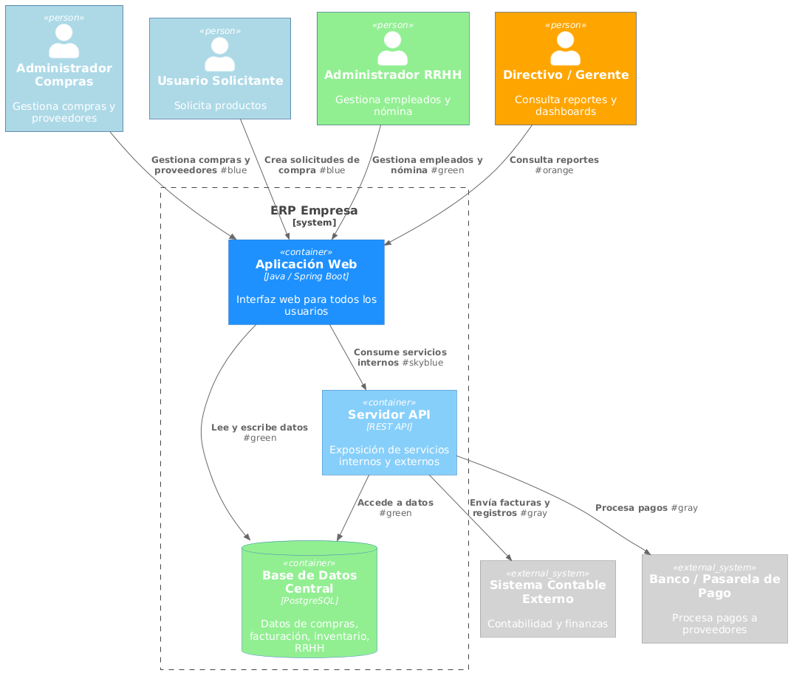

# Vista de Contenedores (C2)

El diagrama de contenedores muestra la arquitectura interna del ERP, separando los principales contenedores y sus responsabilidades:

1. **Aplicación Web (Web App):** Interfaz principal para usuarios internos, permite gestionar compras, solicitudes, empleados y consultar reportes.  
2. **Servidor API (API Server):** Exposición de servicios REST para interacción interna y con sistemas externos, maneja la lógica de negocio y validaciones.  
3. **Base de Datos Central (DB):** Almacena de manera estructurada todas las entidades del ERP: proveedores, productos, solicitudes, órdenes, empleados, activos fijos.  

## Diagrama de Contenedores (C2)

