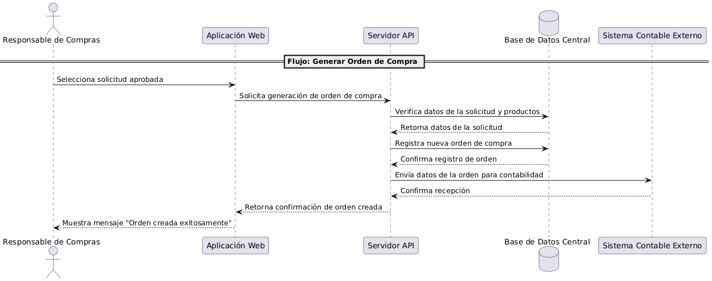

# Vista de Ejecución (Runtime)

## Escenario Crítico: Generar una Orden de Compra

Este escenario describe cómo el sistema ERP procesa la creación de una orden de compra a partir de una solicitud aprobada.

### Flujo de Interacciones
1. El **Responsable de Compras** selecciona una solicitud aprobada en la web.  
2. La **Aplicación Web** envía la solicitud al **Servidor API**.  
3. El **API** verifica los datos en la **Base de Datos**.  
4. Se registra la **Orden de Compra** en la base de datos.  
5. El **API** envía la información de la orden al **Sistema Contable Externo**.  
6. Se confirma la creación de la orden en la **Aplicación Web** y se notifica al usuario.

## Diagrama de Secuencia

