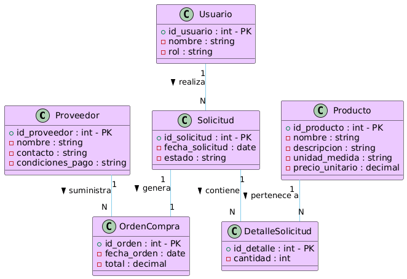

# Glosario

- **Producto:** Artículo disponible para compra, con nombre, descripción, unidad de medida y precio unitario.  
- **Proveedor:** Empresa o persona que suministra productos a la compañía.  
- **Solicitud de Compra:** Petición de productos realizada por un usuario solicitante, que puede ser aprobada o rechazada.  
- **Detalle de Solicitud:** Relación entre una solicitud y los productos solicitados, con cantidades específicas.  
- **Orden de Compra:** Documento formal que autoriza la compra de productos a un proveedor, generado a partir de una solicitud aprobada.  
- **Usuario:** Persona que interactúa con el ERP, con roles como administrador de compras, solicitante, RRHH o directivo.

